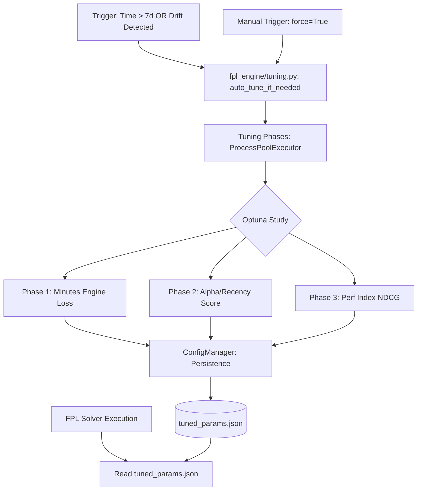

# System Architecture: FPL Parameter Tuning

This document maps the data flow and persistence boundaries between the automated tuning engine and the primary FPL solver.

## Data Flow Diagram

## Core Components

### 1. Tuning Orchestrator (`fpl_engine/tuning.py`)
Replaces the legacy `fpl_tuner.py`. Integrated directly into the `auto_tune_if_needed` function. It evaluates the "Staleness Policy" and manages the phased execution of Optuna studies.

### 2. Multi-Phase Optimization
Executes sequential optimization phases to ensure convergence:
- **Phase 1 (Minutes)**: Optimizes EMA weights and "Rest Overrides" using a capped-penalty composite loss.
- **Phase 2 (Recency)**: Tunes the alpha decay rates for team and player ratings.
- **Phase 3 (Perf Index)**: Fine-tunes the Performance Index shrinkage constants using NDCG (Normalized Discounted Cumulative Gain).

### 3. Persistence Layer (`tuned_params.json`)
The **Single Source of Truth** for the engine's hyperparameters.
- **Automated Updates**: Phased Optuna runs calculate production-ready weights and write them here.
- **Adaptive Targets**: Includes season-adaptive scalars (e.g., `league_avg_xG`) that adjust as the meta shifts.

### 4. Mathematical Guards
- **Hybrid Skellam-Normal**: Duel evaluations automatically fall back to Normal approximations in lopsided matchups to prevent numerical instability.
- **Independent Scenarios**: Stochastic draws are player-specific, ensuring that squad-level risk metrics (CVaR) reflect genuine diversification rather than broadcasted noise.

