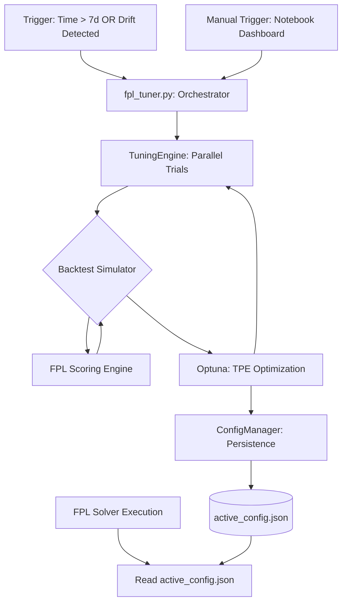

# System Architecture: FPL Parameter Tuning

This document maps the data flow and persistence boundaries between the automated tuning engine and the primary FPL solver.

## Data Flow Diagram

## Core Components

### 1. Automated Orchestrator (`fpl_tuner.py`)
Responsible for evaluating the "Staleness Policy." It checks the `last_updated` timestamp in the persistence layer and calculates if the model weights have entered a period of recency decay.

### 2. Tuning Engine (Parallelized)
Executes concurrent optimization trials using `ProcessPoolExecutor`. It simulates historical gameweeks to find the optimal weights for:
- Fixture Difficulty
- Form Decay Rates
- Positional Variance Penalties

### 3. Persistence Layer (`active_config.json`)
The **Single Source of Truth** for the solver's runtime parameters. 
- **Automated Updates**: Successfully completed Optuna studies overwrite this file.
- **Manual Overrides**: UI interactions in the Jupyter Notebook can explicitly set weights, which are then materialized into this JSON file.

### 4. Boundary Enforcement
The `FPLWeights` data model enforces strict schema validation (e.g., bounds checking) to ensure that neither a corrupted tuning run nor an erroneous manual entry can crash the primary `fpl_engine` solver.
